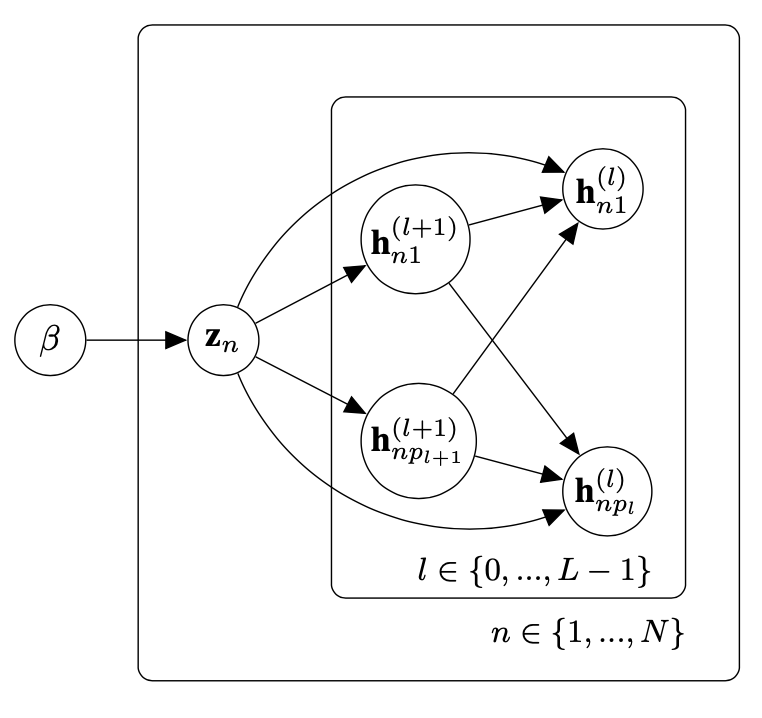

# Dirichlet Process Variational AutoEncoder
In this repository you will find the implementation of the DP-VAE described in the following paper: https://hal.archives-ouvertes.fr/hal-02864385v2
## Graphical model



## Mathematical model


## Generated samples


## Training code

```console
foo@bar:~$ python train.py --mnistdir dir 
```
```console
foo@bar:~$ tensorboard --logdir runs
```
